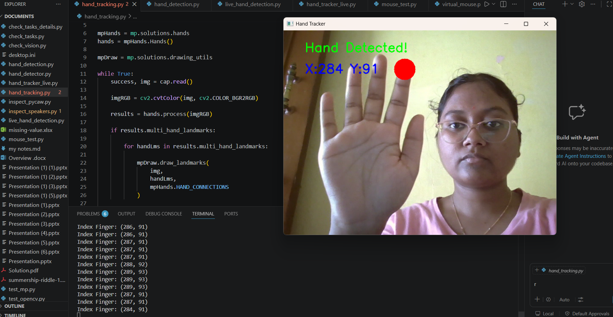
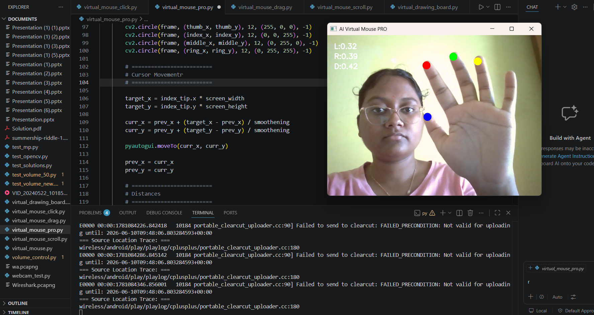
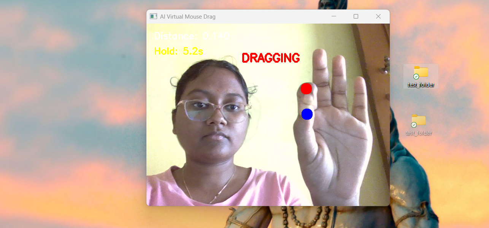
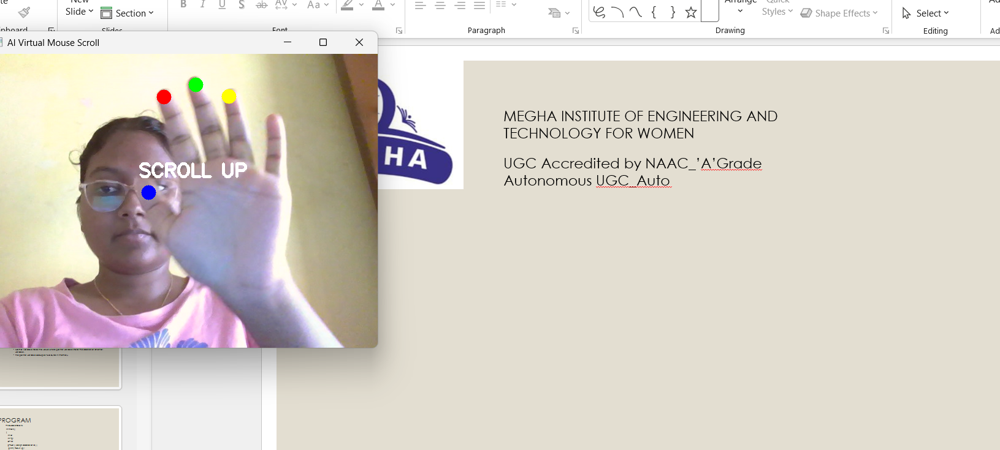
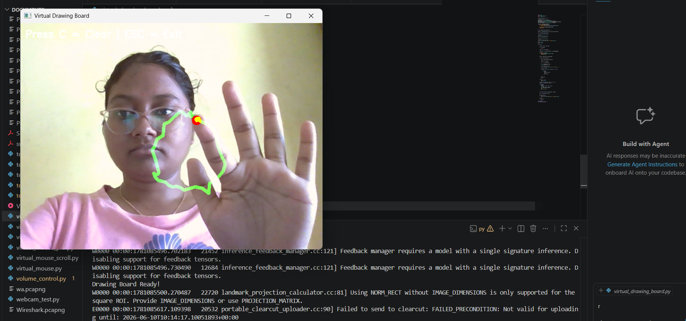
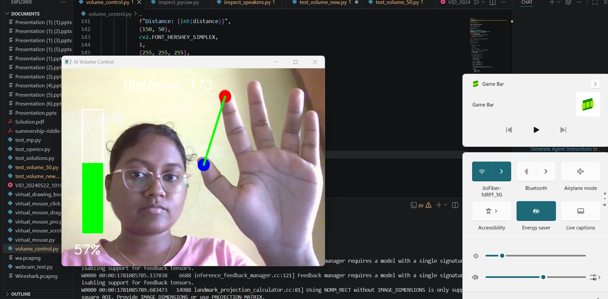

# AI Virtual Mouse
### Gesture Controlled Human-Computer Interaction System

An AI-powered Virtual Mouse and Gesture Control System built using Python, OpenCV, and MediaPipe.

## Overview

This project enables users to control their computer using hand gestures captured through a webcam. The system tracks hand landmarks in real time and converts gestures into mouse actions, scrolling, drawing, drag-and-drop operations, and volume control.

##Case Study

Problem
Traditional input devices assume everyone has easy, reliable access to a physical mouse and keyboard. That's not always true — and even when it is, touchless, gesture-based control opens up new ways to interact with a computer that don't need any hardware beyond a webcam.

What I did
I built a real-time gesture control system in Python using OpenCV for video processing and MediaPipe for hand landmark detection. The system tracks hand position and finger gestures through a webcam feed and translates them into computer actions across six modules:

Virtual Mouse — cursor movement + left/right/double-click via hand gestures
Drag and Drop — moving files/folders with gesture control
Scrolling — page scroll via finger movement
Virtual Drawing Board — freehand drawing tracked by index finger position
Volume Control — system volume adjusted by finger-distance gestures
Hand Tracking — the real-time landmark detection layer underpinning everything above

Built with Python, OpenCV, MediaPipe, PyAutoGUI, NumPy, and Pycaw.

What came of it
All six modules work reliably with accurate, low-latency gesture recognition — demoed live and on video. The project turned a single "virtual mouse" idea into a full gesture-based interaction suite.

##Watch demo
 https://drive.google.com/file/d/130eYZ-w94DCumnSN3SMKj7E18okRVy6j/view?usp=sharing

## Features

* Real-Time Hand Tracking
* Virtual Mouse Movement
* Left Click Gesture
* Right Click Gesture
* Double Click Gesture
* Drag and Drop Functionality
* Scroll Up and Scroll Down
* Virtual Drawing Board
* Volume Control using Hand Gestures

## Project Modules

1. Hand Tracking
   - Detects hand landmarks using MediaPipe.

2. Virtual Mouse
   - Controls cursor movement and mouse clicks.

3. Drag and Drop
   - Allows dragging files and folders using gestures.

4. Scrolling
   - Scrolls pages using finger gestures.

5. Drawing Board
   - Draws on a virtual canvas using index finger movement.

6. Volume Control
   - Adjusts system volume based on finger distance.

## Technologies Used

* Python
* OpenCV
* MediaPipe
* PyAutoGUI
* NumPy
* Pycaw

## Project Structure

```text
## Project Structure

```text
AI-Virtual-Mouse/
│
├── hand_tracker_live.py
├── virtual_mouse_pro.py
├── virtual_mouse_drag.py
├── virtual_mouse_scroll.py
├── virtual_drawing_board.py
├── volume_control.py
├── requirements.txt
│
├── hand_tracking.png
├── virtual_mouse_pro.png
├── drag_drop.png
├── scrolling.png
├── drawing_board.png
└── volume_control.png
```

## Screenshots

### Hand Tracking



### Virtual Mouse



### Drag and Drop



### Scrolling



### Virtual Drawing Board



### Volume Control



## Run the Modules

### Hand Tracking

```bash
python hand_tracker_live.py
```

### Virtual Mouse

```bash
python virtual_mouse_pro.py
```

### Drag and Drop

```bash
python virtual_mouse_drag.py
```

### Scrolling

```bash
python virtual_mouse_scroll.py
```

### Virtual Drawing Board

```bash
python virtual_drawing_board.py
```

### Volume Control

```bash
python volume_control.py
```

```

## Future Enhancements

* Multi-hand gesture support
* Gesture-based presentation control
* Virtual keyboard
* Air writing recognition
* AI gesture customization

## Author

**Tharuni**

Electronics and Communication Engineering Student

Interested in Artificial Intelligence, IoT Architect, Embedded Systems, Python Development, and Human-Computer Interaction.

